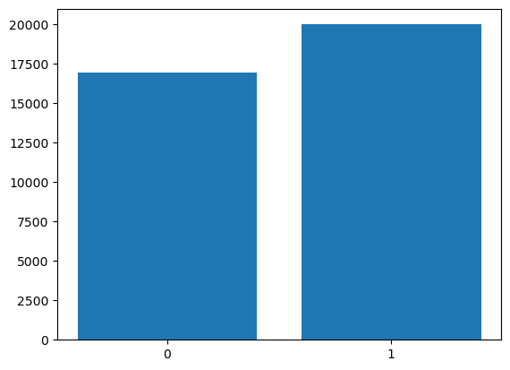
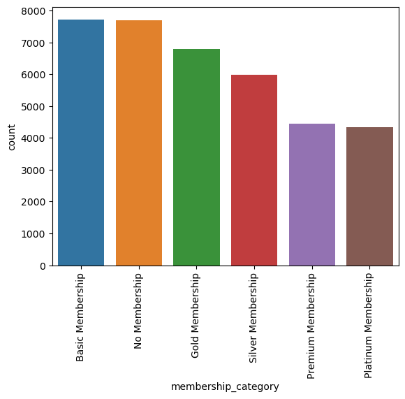
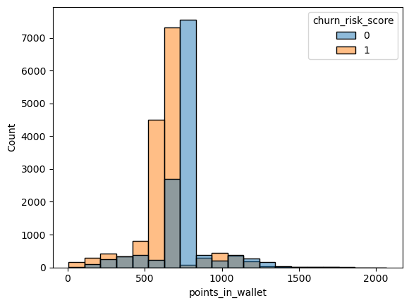
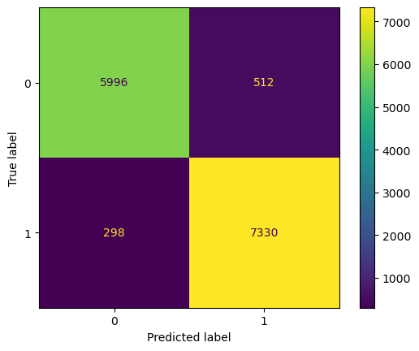
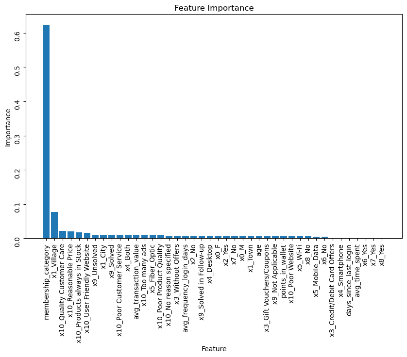

# Customer Churn Rate for E-commerce Company

## Business Problem

When we lose customers, we lose money. I have been tasked by the company heads to predict which customers are at risk of leaving (churning) and taking their business elsewhere. 

Taking into account a range of features, like membership status and website usage, I use machine learning models to successfully predict which customers the company should re-target to retain business.

## Overview

The data comes from the ["Customer Churn"]([url](https://www.kaggle.com/datasets/undersc0re/predict-the-churn-risk-rate)) dataset, posted by Pawan Trivedi on Kaggle. I tried Decision Trees, Logistic Regression, K Nearest Neighbors, Random Forest, and finally XGBoost Classifier to find the best model for prediction. XGBoost Classifier was the best of the lot, succesfully predicting a little over 94% of targets in the test data. From there, I used the model to indicate the most important features, which were membership_category, village region, and customer care feedback.

Based on all of this, I recommend the company uses XGBoost Classifier moving forward to predict customer churn risk. I also suggest use membership category, village region, and customer care feedback to re-target customers.

## Data Understanding

The dataset contains columns focusing on customer site usage, customer transactions, customer demographics like age, gender, location, preferred device and internet type, and more.

I began with some exploratory data analysis. We have an even split in our data between class 0 (not at risk of churn) and class 1(at risk of churn).

EDA further revealed that there are six types of membership. The majority of customers either hold "basic" membership or no membership at all. These categories are also most at risk of churn. "Platinum" members, by contrast, have no risk of churn.

Points also seemed to be a solid indicator of the target, showing key areas that are dominated by class 0 or class 1 when graphed.

## Modeling Results

After trying Decision Trees, Logistic Regression, K Nearest Neighbors, Random Forest, and XGBoost Classifier. I determined that XGBoost Classifier was the best model for predicting churn. We want to minimize the amount of false negatives since these are customers at risk of churn that would fall through the cracks otherwise. We would assume they don't need to be re-targeted but actually do. False positives, by contrast, will not lose us business if we re-target them. 

Here is the confusion matrix for the XGBoost Classifier model:

I used this model to determine which of the features have the greatest influence on the target, and found membership category to be far and away the most important feature. Following this category are customers who are located in villages and customers who have given feedback about customer care quality.

## Answering the Business Question

The XGBoost Classifier had a score of over 94% when validated against the test data. This means it successfully predicted customers who were at risk of churn 94% of the time. It also helped us figure out where the company needs to focus its re-targeting efforts.

Based on all of this, I recommend the company uses XGBoost Classifier moving forward to predict customer churn risk. I also suggest use membership category, village region, and customer care feedback to re-target customers.

## Conclusions
Ultimately, I recommend that the company uses XGBoost Classifier moving forward to predict customer churn risk. I also suggest use membership category, village region, and customer care feedback to re-target customers.

In the future, the model can be improved with:
- Incorporating marketing data.
- Using more up-to-the-date data.
- Including data on re-targeting to determine whether re-targeting hurts or helps.

## Links to Materials
[Presentation](KingCounty_Slides.pdf)  
[Jupyter Notebook](King_County_Analysis_Notebook.ipynb)
